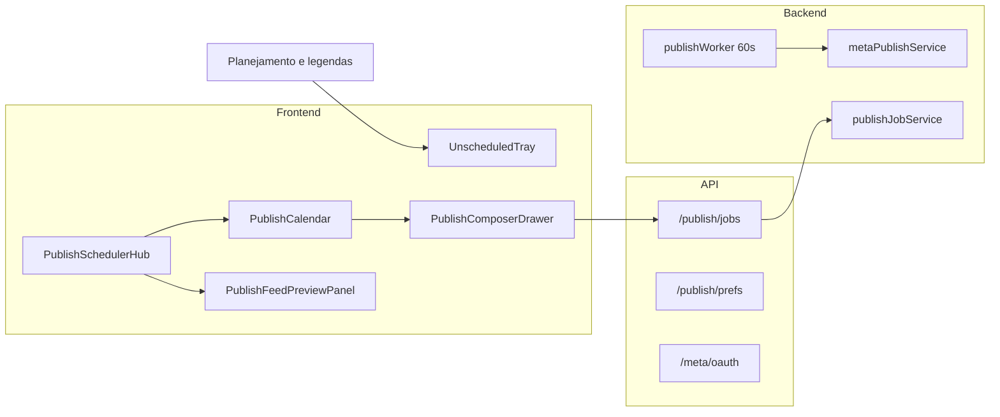

# Programar posts — implementação e pendências

Documentação da funcionalidade **Programar posts** no AuraGrid: o que foi construído, como funciona e o que ainda falta.

Para configurar credenciais Meta, App Review e deploy, veja também [`META-PUBLISHING.md`](./META-PUBLISHING.md).

---

## Visão geral

A seção **Programar posts** (`/c/:clientId/programar-posts`) permite agendar no **Instagram** (feed: foto + legenda) os posts já aprovados em **Planejamento e legendas**, por cliente e período de planejamento.

Requisitos para usar:

- Modo **nuvem** (PostgreSQL + armazenamento de mídia)
- Posts com **legenda aprovada**, **foto** e `isConfirmed`
- Conta Instagram **Profissional** conectada via Meta OAuth (ou `META_PUBLISH_MOCK=1` em dev)

---

## Arquitetura



### Banco de dados (migration `0015_meta_publish`)

| Tabela | Uso |
|--------|-----|
| `client_meta_connections` | OAuth, token criptografado, IG user, Page Facebook |
| `client_publish_prefs` | Templates de horário (1–5 posts/dia), timezone, antecedência |
| `instagram_publish_jobs` | Jobs de publicação (caption/imagem snapshot, horário, status) |

### Backend (serviços principais)

| Arquivo | Responsabilidade |
|---------|------------------|
| `server/services/publishJobService.ts` | Fila, criar/cancelar/reagendar jobs, preview de horários |
| `server/services/publishWorker.ts` | Loop que publica jobs no horário |
| `server/services/metaPublishService.ts` | Container → poll → publish na Graph API (ou mock) |
| `server/services/metaOAuthService.ts` | Fluxo OAuth start/callback |
| `server/services/metaConnectionService.ts` | Persistência e refresh de conexão |
| `server/services/mediaPublishUrl.ts` | URL pública/presigned da imagem para a Meta |

### Frontend (Scheduler Hub)

| Componente | Função |
|------------|--------|
| `PublishSchedulerHub.tsx` | Orquestra views, estado, polling, bulk confirm |
| `PublishCalendar.tsx` | Calendário semana/mês, drag-and-drop, gaps |
| `PublishCalendarToolbar.tsx` | Navegação temporal + toggle Calendário / Lista / Config |
| `UnscheduledTray.tsx` | Bandeja de posts prontos (arrastar para o calendário) |
| `PublishComposerDrawer.tsx` | Painel lateral: preview IG, horário, agendar/reagendar |
| `PublishFeedPreviewPanel.tsx` | Feed 3×3 integrado com badges de agendamento |
| `PublishListView.tsx` | Lista operacional com filtros e ações em lote |
| `PublishPreviewModal.tsx` | Confirmação multi-post com carrossel |
| `PublishPrefsPanel.tsx` | Horários rápidos + conexão Meta (quando conectado) |
| `MetaConnectionCard.tsx` | Conectar / desconectar / reconectar |
| `publishCalendarUtils.ts` | Buckets, gaps, conflitos, overlay do feed |

Entrada: `PostSchedulingWorkspace.tsx` → `PublishSchedulerHub` (wire em `App.tsx`).

---

## O que foi implementado

### UX / interface

- [x] **Scheduler Hub** com três views: Calendário (default), Lista, Config
- [x] Calendário **semana** e **mês** com cards empilhados por dia
- [x] **Drag-and-drop** da bandeja para o calendário; reagendar jobs `queued` via PATCH
- [x] **Preencher automaticamente** — sugere horários só para posts cujo dia de planejamento cai no período visível
- [x] **Gaps** — destaque de dias do planejamento sem agendamento
- [x] **Cores por status** nos cards (agendado, publicando, no ar, erro, rascunho)
- [x] Vista mês com **"+N mais"** e expansão ao clicar no dia
- [x] **Composer** lateral (preview Instagram, legenda, data/hora, cancelar, retry)
- [x] **Feed 3×3** no painel direito (desktop) e bottom sheet (mobile)
- [x] Badges de horário/status nas miniaturas do feed
- [x] Modal de confirmação com **carrossel** para vários posts
- [x] Lista com filtros (Todos, Prontos, Agendados, Publicados, Com problema)
- [x] **Retry em lote** e **cancelar agendamentos em lote** (lista)
- [x] Aviso de **conflito de horário** (dois posts no mesmo minuto)
- [x] Métricas no toolbar + limite **X/100 publicações (24h)**
- [x] Polling da fila a cada **30s**
- [x] Layout estável: toolbar sempre acima do card Meta em todas as views
- [x] Modo local: aviso “Modo nuvem necessário”
- [x] Atalhos ←/→ para mudar semana/mês; Esc fecha o composer

### Backend / integração

- [x] CRUD de jobs + preview de horários (`suggestScheduleTimes`)
- [x] Prefs por cliente (templates 1–5 posts/dia, antecedência mínima)
- [x] OAuth Meta (start, callback, disconnect)
- [x] Token criptografado em repouso
- [x] Worker em `instrumentation.ts` (intervalo 60s)
- [x] Publicação real via Instagram Content Publishing API
- [x] Modo mock (`META_PUBLISH_MOCK=1`) para dev sem credenciais
- [x] URLs presigned/públicas de mídia para a Meta
- [x] Rate limit ~100 publicações / 24h por cliente
- [x] Erros Meta traduzidos para linguagem leiga no backend

### Rotas API

```
GET/DELETE  /api/v1/clients/:id/meta/connection
GET         /api/v1/clients/:id/meta/oauth/start
GET         /api/v1/meta/oauth/callback
GET/PUT     /api/v1/clients/:id/publish/prefs
GET/POST    /api/v1/clients/:id/publish/jobs          (+ summary no GET)
POST        /api/v1/clients/:id/publish/jobs/preview
PATCH       /api/v1/clients/:id/publish/jobs/:jobId
POST        /api/v1/clients/:id/publish/jobs/:jobId/retry
GET         /api/v1/media/:assetId/publish
```

### Testes automatizados

- [x] `npm run test:publish` — `suggestScheduleTimes` + `publishCalendarUtils`
- [x] `npm run test:app-routing` — round-trip `/programar-posts`
- [x] `npm run lint` — TypeScript sem erros

---

## Fluxo do usuário (resumo)

1. Aprovar posts em **Planejamento e legendas** (foto + legenda + confirmar).
2. Abrir **Programar posts** na sidebar.
3. Conectar Instagram (Config ou card abaixo da toolbar) — **opcional em dev** com `META_PUBLISH_MOCK=1`.
4. Opcional em **Config**: **Horários rápidos**, antecedência mínima e **Agendar ao soltar**.
5. Na bandeja **Prontos**, arrastar posts para o calendário **ou** usar **Preencher automaticamente**.

### Modo rascunho (padrão)

- Arrastar cria um **rascunho** (persistido na sessão do navegador).
- O post **sai da bandeja** e aparece no calendário com borda âmbar.
- Banner **“N rascunhos · Confirmar agendamento”** → modal de preview → jobs `queued` no banco.

### Modo agendar ao soltar (Config)

- Arrastar chama a API imediatamente (`POST createPublishJobs`).
- Posts já agendados (`queued`) podem ser **rearrastados** (PATCH do horário).

6. Ajustar horários no composer (salvar rascunho, agendar ou remover rascunho).
7. Worker publica no horário; acompanhar no calendário/lista (status + polling).

### O que conta como “pronto para agendar”

Post com **legenda + foto + aprovação** (`status: eligible`). Os demais aparecem como **incompletos** no contador e na aba Lista.

---

## O que ainda falta

### Configuração externa (sua parte / deploy)

| Item | Status |
|------|--------|
| App Meta em [developers.facebook.com](https://developers.facebook.com/) | Pendente em produção |
| App Review Meta (screencast + Privacy Policy) | Pendente |
| Env vars de produção (`META_*`, `NEXT_PUBLIC_APP_URL`) | Configurar no deploy |
| Contas Instagram Profissional + Page Facebook por marca | Por cliente |
| HTTPS estável no domínio público | Requisito Meta |

### Produto / funcionalidades não implementadas

| Item | Notas |
|------|--------|
| Publicação no **Facebook Page** (feed) | Só Instagram hoje; Page é pré-requisito OAuth |
| **Stories / Reels** | Fora de escopo inicial |
| Faixas horárias 08–22h no calendário | Usamos cards compactos por dia, não grade horária |
| Sincronizar job quando post fonte muda após agendar | Job guarda snapshot; sem aviso automático na UI |
| Seleção em lote no calendário (intervalo de dias) | Bulk parcial (confirmar todos com draft, retry/cancel na lista) |
| Notificações push/e-mail ao publicar ou falhar | Só polling + toast |
| Analytics pós-publicação (alcance, engajamento) | Sem integração Insights |
| Aprovações multi-usuário (estilo Hootsuite) | Um fluxo por conta logada |
| Múltiplas contas Instagram por cliente | Uma conexão Meta por cliente |
| Timezone picker na UI | Fixo `America/Sao_Paulo` nas prefs |

### Técnico / operação

| Item | Notas |
|------|--------|
| **Job de refresh de token** Meta (~60 dias) | Reconexão manual na UI; cron semanal recomendado |
| WebSocket ou SSE para status em tempo real | Hoje: polling 30s |
| Endpoint `GET .../publish/jobs/summary` dedicado | Summary já vem no GET da fila |
| Testes E2E (Playwright) do fluxo completo | Só unitários hoje |
| Documentação de troubleshooting Meta (códigos de erro comuns) | Parcial via `translateMetaError` |

### Melhorias de UX (opcionais)

- Abrir semana automaticamente ao expandir dia no modo mês
- Legenda editável inline no composer (hoje link para Planejamento)
- Indicador visual quando post agendado diverge do dia editorial (D1–D30 vs data de publicação)
- Undo após confirmar programação em lote

---

## Desenvolvimento local

```env
META_PUBLISH_MOCK=1
DATABASE_URL=postgresql://...
MINIO_*=...
NEXT_PUBLIC_APP_URL=http://localhost:3000
META_OAUTH_REDIRECT_URI=http://localhost:3000/api/v1/meta/oauth/callback
```

```bash
npm run dev
npm run test:publish
npm run test:app-routing
npm run lint
```

Fluxo de teste sem Meta real: `META_PUBLISH_MOCK=1` → aprovar posts → Programar posts → arrastar ou Preencher automaticamente → Confirmar (ou ativar “Agendar ao soltar”) → worker mock marca como `published`.

---

## Mapa de arquivos (referência rápida)

```
src/components/publish/          # UI Scheduler Hub
src/lib/publish/                 # API client + suggestScheduleTimes
src/hooks/usePublishQueuePoll.ts
server/services/publish*.ts
server/services/meta*.ts
server/db/migrations/0015_meta_publish.sql
app/api/v1/clients/.../publish/
app/api/v1/clients/.../meta/
docs/META-PUBLISHING.md          # Meta OAuth, App Review, env vars
```

---

## Histórico de entregas (resumo)

1. **MVP** — Fila, prefs, OAuth, worker mock/real, API completa.
2. **Scheduler Hub** — Calendário, bandeja, composer, feed 3×3, lista operacional.
3. **Refinamento** — Gaps, conflitos, bulk, layout toolbar/card Meta, testes `publishCalendarUtils`.

Última revisão documental: junho/2026.
